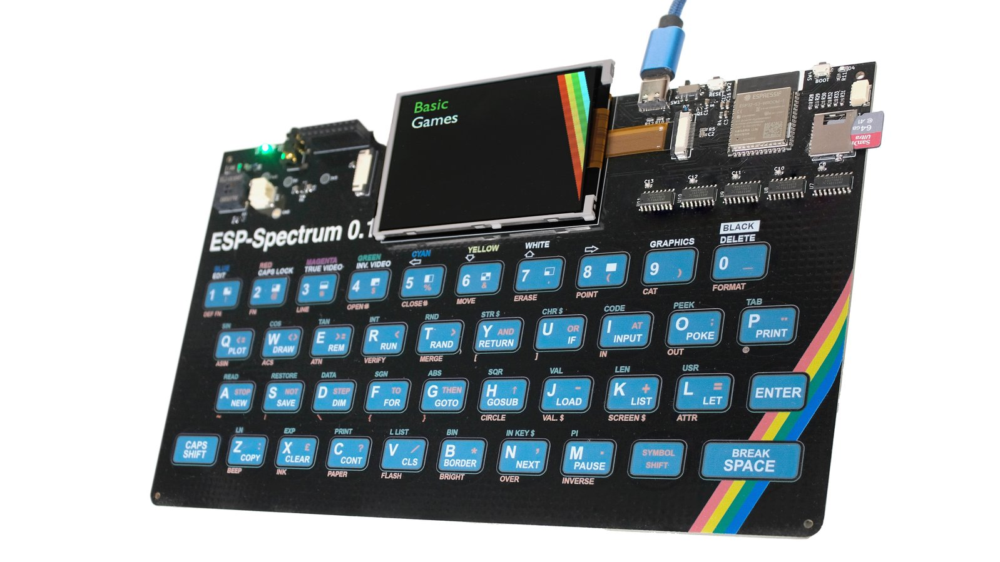

[](https://github.com/atomic14/esp32-zxspectrum/actions/workflows/build_firmware.yml)

# ESP32 Rainbow

This repository contains the software for the [ESP32 Rainbow project](https://www.crowdsupply.com/atomic14/esp32-rainbow).



The code is designed for my board, but will run on pretty much any ESP32 board.

This is currently a work in progress and is under active development. So, I can't guarantee that the code will be stable.

# Bulding the firmware

You will need to install [Visual Studio Code](https://code.visualstudio.com/download) and [PlatformIO](https://platformio.org/install) to build the code.

The firmware lives in the `firmware` directory. Open this folder in [Visual Studio Code](https://code.visualstudio.com/download) and PlatformIO will take care of the rest.

# Supported boards

Check the `platformio.ini` file for the complete list of suppoted boards.

To add a new board make a copy of an existing board section in the file and modify the pins to match your board.

- ESP32 Rainbow
- Cheap Yellow Display (CYD)
- LilyGo T-Deck

Pretty much any ESP32 board should work, you just need a 320x240 TFT display and either an I2S amplifier or speaker driven with a transistor. If you don't have any sound output options, then just specify a dummy pin for the buzzer.

# Input

My board (the [ESP32 Rainbow](https://www.crowdsupply.com/atomic14/esp32-rainbow) has a built in keyboard and has 2xQWIIC connectors which can be used to connect a wide range of controllers (e.g. Wii Nunchucks).

The LilyGo T-Deck has a keyboard, but the firmware for the keyboard is pretty terrible making it very hard to use.

The CYD has no keyboard, but you should be able to hook up I2C devices to it.

Alternatively, you can use some python code in the `keyboard-server` directory to use your desktop keyboard to type. This has only been tested on a Mac - I've no idea if it will work on Windows.

```sh
cd keyboard-server
python3 -m venv venv
source venv/bin/activate
pip install -r requirements.txt
python serial_keyboard.py
```

# SDCard/Flash Storage

The CYD and my board have an SD card slot that is independent of the SPI bus used by the TFT display. This means you can use the SD card slot to store games.

The LilyGo T-Deck has as SD card but it uses the same SPI bus as the TFT display. I have not managed to get both of them to work simultaneously. If someone wants to dig into this and fix it then please let me know.

If you can't use the SD card then drop any games (z80 or tzx/tap) into the `data` folder. You will then need to use the platformio menu to upload the filesystem to the device.

For anyone using an SD card, make sure it is formatted with the FAT32 filesystem and drop any games (z80 or tzx/tap) into the root of the card.

# Help Support Development

If you find this project useful and want to help support further development then please consider buying a board from my [Crowd Supply](https://www.crowdsupply.com/atomic14) page.

Or you can back me on [Patreon](https://www.patreon.com/atomic14).